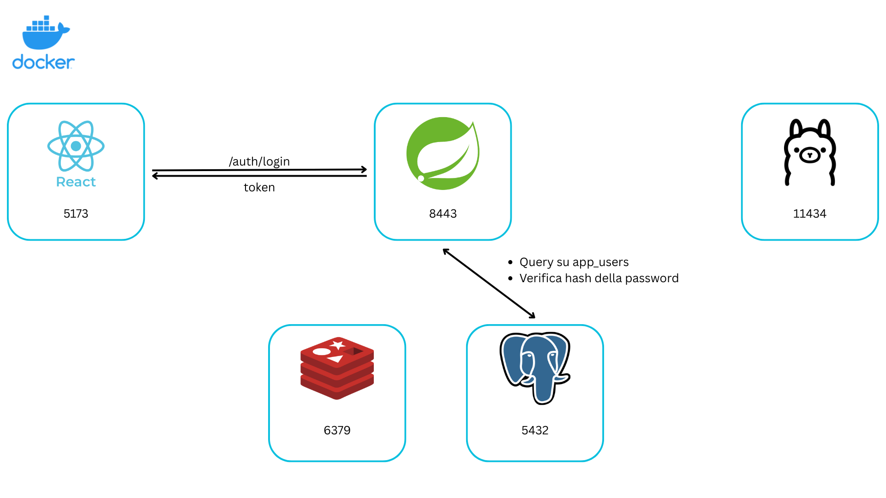
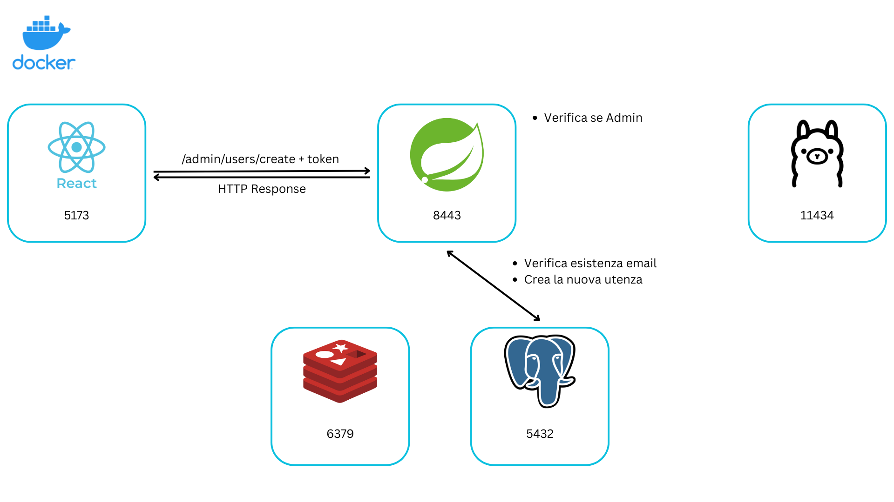
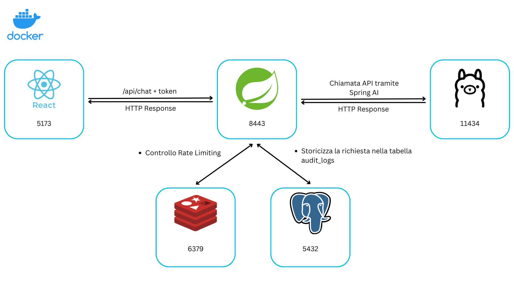
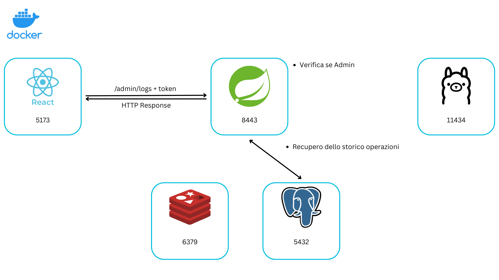

# HRAssistant
**HRAssistant** è una piattaforma sviluppata per la gestione automatizzata delle risorse umane, progettata con un focus sulla sicurezza architetturale, l'isolamento dei servizi e l'integrazione di un LLM locale per garantire la privacy dei dati sensibili.

Caso di studio realizzato per l'esame di Sicurezza delle Architetture Orientate ai Servizi dell'Università degli Studi di Bari.

# Indice

- [HRAssistant](#hrassistant)
  - [Scenario](#scenario)
  - [Stack Tecnologico](#stack-tecnologico)
  - [Infrastruttura e Librerie](#infrastruttura-e-librerie)

- [Guida alla replicazione](#guida-alla-replicazione)
  - [Prerequisiti](#prerequisiti)
  - [Configurazione Ambiente e Segreti (.env)](#configurazione-ambiente-e-segreti-env)
  - [Generazione Certificati SSL (HTTPS)](#generazione-certificati-ssl-https)
  - [Avvio Infrastruttura Docker](#avvio-infrastruttura-docker)

- [Approcci di sicurezza adottati](#approcci-di-sicurezza-adottati)

- [Architettura del Sistema](#architettura-del-sistema)


## Scenario
La piattaforma funge da intermediario sicuro tra i dipendenti e i dati aziendali, sfruttando un LLM (Large Language Model) locale per evitare la fuga di dati verso terzi.
* **Dipendenti (Role USER):** Possono interrogare l'assistente per informazioni su buste paga, ferie e policy aziendali.
* **HR Admin (Role HR_ADMIN):** Gestiscono i documenti e monitorano gli audit log delle interazioni.
* **AI Engine (Ollama):** Analizza le richieste in linguaggio naturale all'interno di un perimetro di rete isolato.

## Stack Tecnologico
* **Linguaggio:** Java 21 (LTS)
* **Framework:** Spring Boot 3.2.5
* **Containerizzazione:** Docker Compose v2

### Infrastruttura e Librerie
* **Database:** PostgreSQL 16
* **Cache:** Redis 7.2
* **AI Engine:** Ollama con modello Llama 3 (LLM on-premise)
* **Sicurezza:** Spring Security, SSL/TLS (Self-signed PKCS12)
* **Comunicazione AI:** Spring AI 0.8.1

---

# Guida alla replicazione

### Prerequisiti
* Java JDK 21
* Maven
* Docker & Docker Compose v2

### Configurazione Ambiente e Segreti (.env)

1. Creare un file `.env` nella root del progetto (non tracciato da Git).
2. Copiare il contenuto dal template seguente:

```properties
# Database Configuration
POSTGRES_USER=admin_hr
POSTGRES_PASSWORD=change_me
DB_NAME=hr_db
DB_HOST=hr_postgres

DB_USER=admin_hr
DB_PASSWORD=change_me

# SSL
SSL_KEY_PASSWORD=changeit

# JWT
JWT_SECRET_KEY=your_super_secret_jwt_key_here
# Scadenza in millisecondi
JWT_EXPIRATION=86400000

# Redis
REDIS_HOST=hr_redis
REDIS_PORT=6379

# Ollama
OLLAMA_HOST=http://hr_ollama:11434
```

> **Nota:** Il file `.env` è inserito nel `.gitignore` per evitare leak di sicurezza su GitHub.
Per generare i token JWT viene usato l'algoritmo HMAC-SHA256.

## Generazione Certificati SSL (HTTPS)

Il backend espone le API esclusivamente su HTTPS (Porta 8443). È necessario generare un Keystore.
Eseguire il comando nella cartella `hr-assistant\src\main\resources`:

```bash
keytool -genkeypair \
  -alias hr-assistant \
  -keyalg RSA \
  -keysize 2048 \
  -storetype PKCS12 \
  -keystore keystore.p12 \
  -validity 3650

```

> **Nota:** Quando richiesto, inserire una password che deve coincidere con `SSL_KEY_PASSWORD` nel file .env.

## Avvio Infrastruttura Docker

L'intero sistema (Database, Redis, Ollama, Backend e Frontend) è containerizzato. Per garantire un avvio corretto, il download del modello AI e la creazione degli utenti, 
eseguire i seguenti comandi:

```bash
# Entra nella cartella backend, compila il file .jar
cd hr-assistant && ./mvnw clean package -DskipTests && cd ..

# Ricostruisce le immagini e avvia tutti i container in background
docker compose up -d --build

# Scarica ed esegue il modello llama3 (circa 4.7GB). 
# Una volta finito, puoi digitare '/bye' per uscire dalla chat.
docker exec -it hr_ollama ollama run llama3
```
Il Backend Spring Boot viene avviato automaticamente all'interno del container Docker.

1. **Monitoraggio:** Per verificare che il backend sia attivo e controllare i log:
```bash
docker logs -f hr-assistant

```

2. **Accesso SSL (Passaggio Critico):**
Poiché si utilizza un certificato Self-Signed, il browser bloccherà le connessioni.
* Aprire il browser su: `https://localhost:8443/auth/login`
* Accettare il rischio di sicurezza (Avanzate -> Procedi su localhost).
* **Senza questo passaggio, il Frontend non potrà comunicare con il Backend.**

3. **Primo Accesso**

Grazie allo script di inizializzazione automatica del database (`init.sql`), l'ambiente è pronto all'uso immediatamente dopo il primo avvio.
* Aprire il browser all'indirizzo `http://localhost:5173`.
* Utenza Predefinita: Il database viene popolato automaticamente con le seguenti credenziali amministratore:
   * Email: `admin@hr.com`
   * Password: `admin123`
* Gestione Utenti: Una volta effettuato l'accesso come `HR_ADMIN`, è possibile creare nuovi utenti o visualizzare i log di sistema.

# Approcci di sicurezza adottati

* **Role-Based Access Controll:** Filtri granulari in Spring Security che limitano le API in base al ruolo (`USER` o `HR_ADMIN`).
* **Autenticazione Tramite JWT Custom:** Utilizzo di JSON Web Token firmati con HMAC-SHA256. Permette di gestire le sessioni senza salvare dati sensibili sul server, migliorando la scalabilità e la sicurezza.
* **Hashing delle Password:** Le credenziali non sono mai salvate in chiaro. Viene usato BCrypt per generare hash per scongiurare attacchi di tipo brute-force e rainbow table.
* **Crittografia in Transito:** Tutte le comunicazioni tra client e server avvengono su protocollo HTTPS (porta 8443) per impedire l'intercettazione dei dati.
* **Isolamento di Rete:** Il servizio AI è confinato in una rete virtuale interna Docker. Non esponendo porte pubbliche, è protetto da attacchi diretti e accessibile solo tramite il backend.
* **Rate Limiting con Redis:** Implementazione di un limite di 10 richieste al minuto per utente tramite Bucket4j e Redis. Protegge il sistema da attacchi Denial of Service (DoS) e dall'abuso di risorse.
* **Gestione Esternalizzata dei Segreti:** Password del database e chiavi JWT sono caricate tramite variabili d'ambiente e file `.env`. Questo evita l'esposizione di segreti nel codice sorgente o nei repository.
* **Audit Logging:** Ogni interazione viene registrata in una tabella dedicata su PostgreSQL. Include timestamp, utente e operazione, garantendo la tracciabilità e la non-ripudiabilità, utile in caso di analisi forensi.
* **Protezione della Cache:** Configurazione di header HTTP che impediscono al browser di memorizzare i dati sensibili, evitando che rimangano visibili nella cronologia dopo il logout.
* **CORS Restrittivo:** Le API accettano connessioni esclusivamente dall'origine autorizzata (il frontend su porta 5173), bloccando tentativi di Cross-Origin Request da siti malevoli.
* **Mitigazione Prompt Injection:** La mitigazione della Prompt Injection è implementata nella classe ChatService.java, dove l'input utente viene incapsulato in un System Prompt predefinito che istruisce Llama 3 a ignorare tentativi di bypass dei comandi o richieste di dati sensibili non autorizzati.
* **Sicurezza Client-Side:** Rotte protette nel frontend che verificano la presenza e la validità del token prima di renderizzare qualsiasi componente sensibile.
* **Integrazione LLM Locale:** L'uso di un modello AI on-premise garantisce che i dati dei dipendenti rimangano all'interno dell'infrastruttura aziendale, eliminando i rischi di privacy legati al cloud.

# Architettura del Sistema

## 1. Login
Autenticazione stateless per l'accesso sicuro alla piattaforma.



1.  **Input:** Il Frontend invia le credenziali (`email`, `password`) al Backend.
2.  **Verifica:** Spring Security interroga **PostgreSQL** e valida l'hash della password (BCrypt).
3.  **Generazione Token:** Se le credenziali sono valide, viene creato un **JWT** firmato (HMAC-SHA256).
4.  **Consegna:** Il token viene restituito al client e salvato in `localStorage` per le chiamate future.

## 2. Registrazione Nuovo Utente
Creazione di nuove utenze, riservata esclusivamente agli amministratori.



1.  **Controllo Accessi:** Il filtro di sicurezza blocca la richiesta se il JWT non contiene il ruolo `ROLE_HR_ADMIN`.
2.  **Validazione:** Il Backend verifica che l'email non sia già presente nel Database.
3.  **Sicurezza:** La password temporanea del nuovo utente viene cifrata con **BCrypt**.
4.  **Persistenza:** L'utente viene salvato su **PostgreSQL** e l'operazione viene tracciata.

## 3. Chat con l'AI
Interazione con Ollama.



1.  **Richiesta:** L'utente invia un prompt; il sistema recupera l'identità dal token JWT.
2.  **Protezione:** Controllo su **Redis** per il Rate Limiting (max 10 richieste/min).
3.  **Inference:** Il Backend inoltra la richiesta al container **Ollama** tramite Spring AI.
4.  **Audit:** Domanda e risposta vengono salvate nella tabella `audit_logs` su **PostgreSQL**.
5.  **Risposta:** L'output dell'AI viene restituito all'utente.

## 4. Consultazione Log di Audit
Monitoraggio delle interazioni e delle operazioni di sistema.



1.  **Richiesta:** L'Admin accede alla sezione "Audit Logs".
2.  **Autorizzazione:** Verifica dei permessi amministrativi (`HR_ADMIN`).
3.  **Query:** Il Backend estrae lo storico delle operazioni da **PostgreSQL** (ordinato per data).
4.  **Output:** Viene restituito un JSON contenente: *Utente*, *Azione/Prompt*, *Timestamp* ed *Esito*.